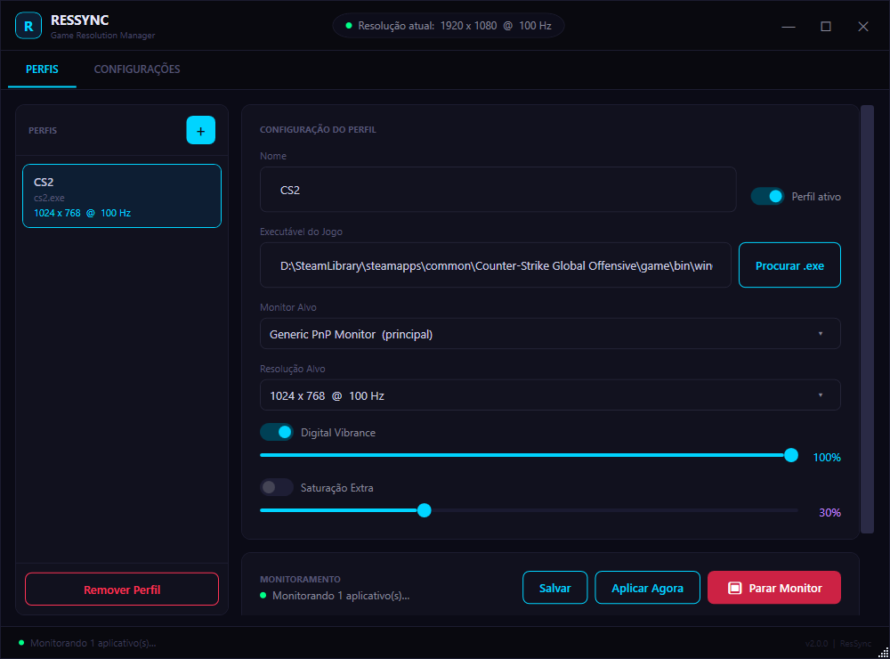

# ResSync

> **Projeto desenvolvido inteiramente por Inteligência Artificial (GitHub Copilot / Claude).**

**ResSync** é uma aplicação Windows (WPF) que gerencia automaticamente resolução de tela, taxa de atualização e vibração digital ao detectar que jogos ou aplicativos específicos foram iniciados.



---

## Funcionalidades

- **Monitoramento de Processos** — Detecta automaticamente quando jogos/apps são executados com base no nome do processo.
- **Ajuste Automático de Display** — Altera resolução, taxa de atualização e vibração digital quando o app monitorado inicia.
- **Restauração Automática** — Reverte todas as configurações de display quando o app monitorado é encerrado.
- **Suporte Multi-Monitor** — Permite direcionar perfis para qualquer monitor conectado.
- **Integração NVIDIA** — Controla Digital Vibrance via NvAPI (`nvapi64.dll`).
- **Saturação Extra via Gamma Ramp** — Aplica curva S no gamma ramp do GDI para cores mais vibrantes (funciona com qualquer GPU).
- **System Tray** — Minimiza para a bandeja do sistema com menu de contexto.
- **Início com Windows** — Pode iniciar automaticamente com o Windows e já minimizado na bandeja.
- **Perfis Persistentes** — Configurações salvas em JSON em `%AppData%\ResSync\config.json`.

---

## Tecnologias

| Componente           | Tecnologia                                         |
| -------------------- | -------------------------------------------------- |
| Framework            | .NET 9.0 (WPF + Windows Forms para NotifyIcon)     |
| Linguagem            | C# 13                                              |
| Display              | Win32 P/Invoke (`ChangeDisplaySettingsEx`, gamma ramps) |
| Vibrance (NVIDIA)    | NvAPI (`nvapi64.dll`)                               |
| Configuração         | `System.Text.Json`                                  |
| Arquitetura          | MVVM (Model-View-ViewModel)                         |

---

## Estrutura do Projeto

```
ResSync.slnx                      # Arquivo de solução
README.md                         # Documentação do projeto
docs/
└── screenshot.png                # Captura de tela da aplicação
ResolutionManager/                # Projeto principal (WPF)
├── App.xaml / App.xaml.cs        # Ponto de entrada, system tray, ciclo de vida
├── GlobalUsings.cs               # Aliases globais (WPF vs WinForms)
├── AssemblyInfo.cs               # Informações do assembly
├── Models/
│   ├── AppConfiguration.cs       # Configuração geral da aplicação
│   ├── AppProfile.cs             # Perfil por aplicativo (resolução, vibrance, monitor)
│   ├── DisplayMonitor.cs         # Representação de um monitor físico
│   └── DisplayResolution.cs      # Resolução + taxa de atualização
├── Native/
│   └── NativeMethods.cs          # P/Invoke: display settings, gamma ramp, teclado
├── Helpers/
│   ├── Converters.cs             # Value converters WPF (Null→Visibility, Bool→Brush…)
│   └── RelayCommand.cs           # Implementação de ICommand
├── Services/
│   ├── IDisplayService.cs        # Interface — resolução, vibrance, saturação
│   ├── DisplayService.cs         # Implementação via Win32 + NvAPI
│   ├── IProcessMonitorService.cs
│   ├── ProcessMonitorService.cs  # Polling de processos (intervalo de 1s)
│   ├── IConfigurationService.cs
│   ├── ConfigurationService.cs   # Persistência JSON em %AppData%\ResSync\
│   ├── NvApiService.cs           # Wrapper NvAPI (Digital Vibrance NVIDIA)
│   ├── IResolutionService.cs     # Interface legada
│   └── ResolutionService.cs      # Implementação legada (use DisplayService)
├── ViewModels/
│   ├── BaseViewModel.cs          # INotifyPropertyChanged base
│   ├── MainViewModel.cs          # ViewModel principal
│   └── ProfileViewModel.cs       # ViewModel de perfil para binding
└── Views/
    ├── MainWindow.xaml            # UI principal (custom chrome, dark theme)
    └── MainWindow.xaml.cs         # Code-behind da janela principal
IconGen/                           # Utilitário para gerar o ícone (app.ico)
├── IconGen.cs
├── Program.cs
└── IconGen.csproj
```

---

## Pré-requisitos

- **Windows 10/11**
- **.NET 9.0 SDK** — [Download](https://dotnet.microsoft.com/download/dotnet/9.0)
- GPU NVIDIA (opcional, necessária para Digital Vibrance via NvAPI)

---

## Como Compilar

```bash
# Build
dotnet build ResolutionManager/ResolutionManager.csproj

# Publicar como executável único (self-contained)
dotnet publish ResolutionManager/ResolutionManager.csproj -c Release -r win-x64 --self-contained true -p:PublishSingleFile=true -o publish
```

---

## Como Usar

1. Execute **ResSync**.
2. Crie um novo perfil clicando em **+**.
3. Selecione o executável do jogo/aplicativo.
4. Escolha o monitor de destino, a resolução desejada e o nível de vibração digital.
5. Ative o monitoramento — o ResSync ajustará o display automaticamente quando o app for detectado e restaurará as configurações quando ele fechar.
6. Minimize para a bandeja do sistema para manter o ResSync rodando em segundo plano.

---

## Licença

Este projeto é de uso pessoal. Todos os direitos reservados.
